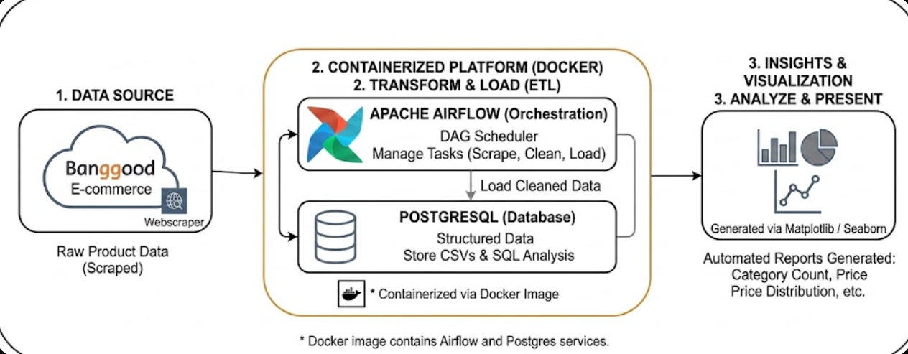
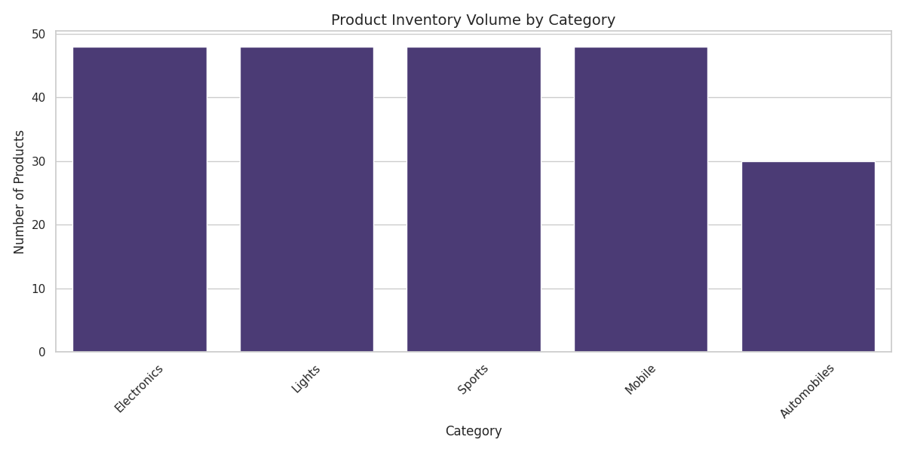
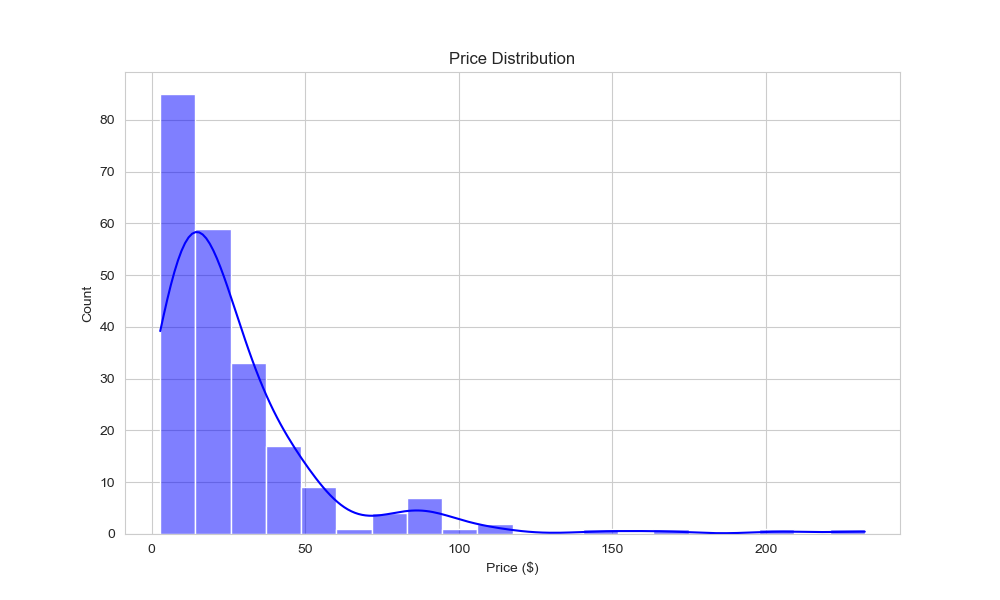
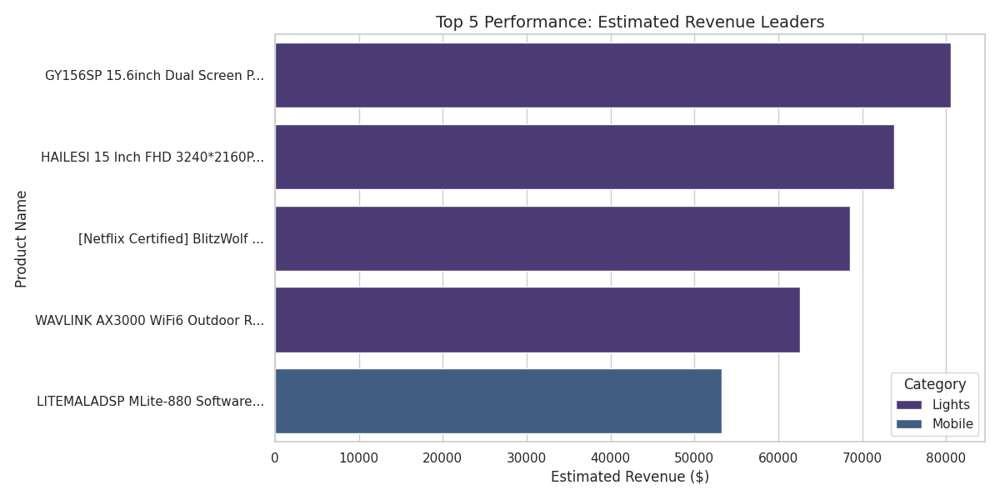
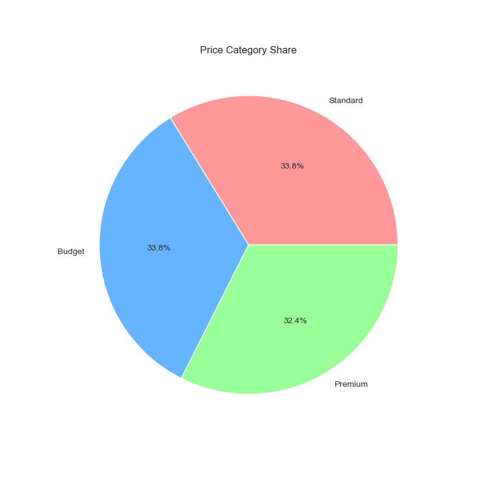
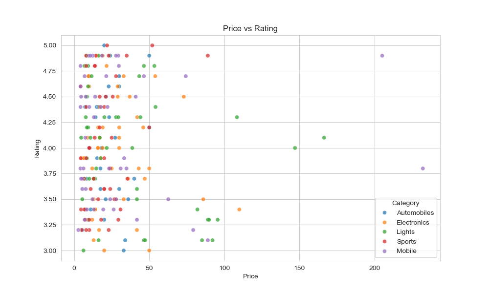
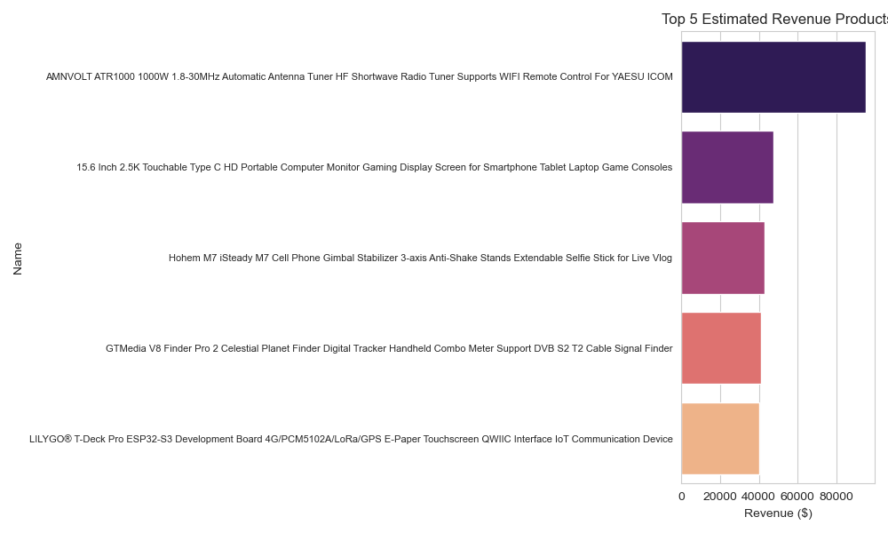

# 🛒 Banggood E-Commerce Data Pipeline


> A fully containerized, end-to-end **ETL (Extract → Transform → Load)** data pipeline that scrapes product data from **Banggood**, orchestrates workflows via **Apache Airflow**, stores structured data in **PostgreSQL**, and generates automated analytical reports using **Matplotlib & Seaborn**.

---

## 📌 Table of Contents

- [Overview](#-overview)
- [Architecture](#-architecture)
- [Tech Stack](#-tech-stack)
- [Project Structure](#-project-structure)
- [Pipeline Workflow](#-pipeline-workflow)
- [Setup & Installation](#-setup--installation)
- [Running the Pipeline](#-running-the-pipeline)
- [Generated Insights](#-generated-insights)
- [Contributing](#-contributing)

---

## 🔍 Overview

This project was built as part of the **CDE Hackathon** and demonstrates a production-style data engineering pipeline. The pipeline:

1. **Scrapes** raw product data (names, categories, prices) from Banggood e-commerce using a custom web scraper
2. **Orchestrates** all tasks (scrape → clean → load) via Apache Airflow DAGs
3. **Stores** cleaned, structured data in a PostgreSQL database for SQL-based analysis
4. **Visualizes** key business insights through automated chart generation

Everything runs inside **Docker containers** — no manual environment setup required.

---

## 🏗️ Architecture



```
┌─────────────────┐     ┌──────────────────────────────────────────┐     ┌──────────────────────┐
│                 │     │        CONTAINERIZED PLATFORM (DOCKER)   │     │   INSIGHTS &         │
│   DATA SOURCE   │────▶│                                          │────▶│   VISUALIZATION      │
│                 │     │  ┌─────────────────────────────────────┐ │     │                      │
│  Banggood.com   │     │  │  APACHE AIRFLOW (Orchestration)     │ │     │  Matplotlib / Seaborn│
│  (Web Scraper)  │     │  │  • DAG Scheduler                    │ │     │                      │
│                 │     │  │  • Tasks: Scrape → Clean → Load      │ │     │  Reports:            │
│  Raw Product    │     │  └──────────────┬──────────────────────┘ │     │  • Category Count    │
│  Data Scraped   │     │                 │ Load Cleaned Data       │     │  • Price Analysis    │
└─────────────────┘     │  ┌──────────────▼──────────────────────┐ │     │  • Distribution      │
                        │  │  POSTGRESQL (Database)               │ │     └──────────────────────┘
                        │  │  • Structured Data Storage           │ │
                        │  │  • CSVs & SQL Analysis               │ │
                        │  └─────────────────────────────────────┘ │
                        │                                          │
                        │  🐳 Containerized via Docker Image       │
                        └──────────────────────────────────────────┘
```

---

## 🛠️ Tech Stack

| Layer | Technology | Purpose |
|---|---|---|
| **Scraping** | Python + Requests/BeautifulSoup | Extract raw product data from Banggood |
| **Orchestration** | Apache Airflow 2.x | DAG-based task scheduling & management |
| **Database** | PostgreSQL 13 | Store cleaned, structured product data |
| **Containerization** | Docker + Docker Compose | Isolated, reproducible runtime environment |
| **Visualization** | Matplotlib + Seaborn | Auto-generate analytical reports & charts |
| **Language** | Python 3.10 | Core pipeline logic |

---

## 📁 Project Structure

```
CDE-HACKATHON/
│
├── dags/                        # Airflow DAG definitions
│   └── banggood_dag.py          # Main ETL DAG (Scrape → Clean → Load)
│
├── scripts/                     # Python scripts for each pipeline stage
│   ├── scrape_banggood.py       # Web scraping logic (Banggood)
│   ├── clean_data.py            # Data cleaning & transformation
│   ├── upload.py                # PostgreSQL data loading
│   ├── analysis.py              # Data analysis logic
│   └── sql_analysis.py          # SQL-based analysis queries
│
├── Data/                        # Raw & processed CSV data files
│   ├── banggood_data.csv        # Raw scraped data
│   └── banggood_cleaned.csv     # Cleaned & transformed data
│
├── Graphs/                      # Auto-generated visualization outputs
│   ├── 1_Category_Count.png
│   ├── 2_Price_Distribution.png
│   ├── 2_Top_Revenue.png
│   ├── 3_Price_PieChart.png
│   ├── 4_Price_vs_Rating.png
│   └── 5_Top_Revenue.png
│
├── docs/
│   └── architecture.png         # Pipeline architecture diagram
│
├── Dockerfile                   # Custom Airflow Docker image
├── docker-compose.yaml          # Multi-service container configuration
├── Requirements.txt             # Python dependencies
└── README.md
```

---

## 🔄 Pipeline Workflow

The Airflow DAG executes the following tasks in sequence:

```
[scrape_banggood] ──▶ [clean_data] ──▶ [load_to_postgres] ──▶ [generate_reports]
```

**Stage 1 — Extract:** The scraper collects product names, categories, prices, and ratings from Banggood and saves raw output as CSV.

**Stage 2 — Transform:** Raw data is cleaned — nulls removed, data types normalized, duplicates dropped, price fields standardized.

**Stage 3 — Load:** Cleaned data is loaded into PostgreSQL tables. SQL queries run for aggregated analysis.

**Stage 4 — Visualize:** Matplotlib/Seaborn scripts auto-generate charts (category distributions, price histograms, etc.) saved to `Graphs/`.

---

## ⚙️ Setup & Installation

### Prerequisites

Make sure you have the following installed:

- [Docker](https://www.docker.com/get-started) (v20+)
- [Docker Compose](https://docs.docker.com/compose/) (v2+)
- [Git](https://git-scm.com/)

### 1. Clone the Repository

```bash
git clone https://github.com/farzan-iqbal/CDE-HACKATHON.git
cd CDE-HACKATHON
```

### 2. Environment Setup

No `.env` configuration needed — all defaults are set in `docker-compose.yaml`.

> ⚠️ If you want to customize PostgreSQL credentials, edit the environment section in `docker-compose.yaml` before proceeding.

### 3. Build & Start Containers

```bash
docker-compose up --build
```

This will spin up:
- **Airflow Webserver** → `http://localhost:8080`
- **Airflow Scheduler**
- **PostgreSQL Database** → port `5432`

Default Airflow credentials:
```
Username: airflow
Password: airflow
```

---

## ▶️ Running the Pipeline

### Via Airflow UI

1. Open `http://localhost:8080` in your browser
2. Login with the credentials above
3. Locate the DAG: **`banggood_etl_pipeline`**
4. Toggle it **ON** and trigger manually via the ▶️ button

### Via CLI

```bash
# Trigger DAG manually from command line
docker-compose exec airflow-scheduler airflow dags trigger banggood_etl_pipeline
```

### Check Logs

```bash
docker-compose logs -f airflow-scheduler
```

---

## 📊 Generated Insights

After a successful pipeline run, the following reports are auto-generated in the `Graphs/` directory:

All charts are auto-generated via `scripts/visualize.py` using **Matplotlib** and **Seaborn**.

### 📈 Category Count


### 💰 Price Distribution


### 🏆 Top Revenue


### 🥧 Price Pie Chart


### ⭐ Price vs Rating


### 🏅 Top Revenue (Extended)


---

## 🛑 Stopping the Pipeline

```bash
docker-compose down
```

To also remove volumes (wipes PostgreSQL data):

```bash
docker-compose down -v
```

---

## 🤝 Contributing

Contributions are welcome! To contribute:

1. Fork the repository
2. Create a feature branch: `git checkout -b feature/your-feature`
3. Commit your changes: `git commit -m 'Add some feature'`
4. Push to the branch: `git push origin feature/your-feature`
5. Open a Pull Request

---

## 👨‍💻 Author

**Farzan Iqbal**
Data Engineer | CDE Hackathon Participant

[](https://www.linkedin.com/in/farzan-iqbal)
[](https://github.com/farzan-iqbal)

---

<p align="center">Built with ❤️ using Python, Airflow, PostgreSQL & Docker</p>
